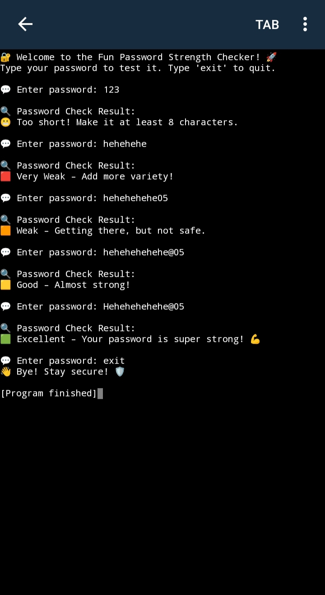

# 🔐 Fun Password Strength Checker 

A fun and interactive Python tool that checks how strong your password is — with emojis, clear feedback, and continuous testing until you type `exit` to quit.

---

### ✨ Features

  - Checks if your password includes:
  - Minimum 8 characters
  - At least one number 
  - At least one uppercase letter 
  - At least one lowercase letter 
  - At least one special character 
  - Keeps asking for passwords until you type `exit`

---

### 🛠️ Technologies Used

- Python 3
- `re` (Regular Expression module)

---

### 💡 Sample Output

---
